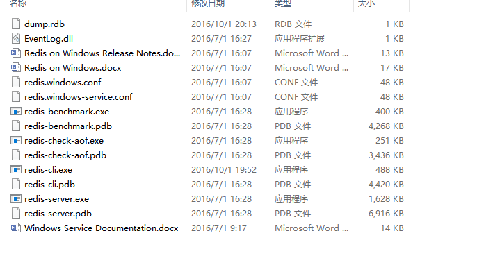
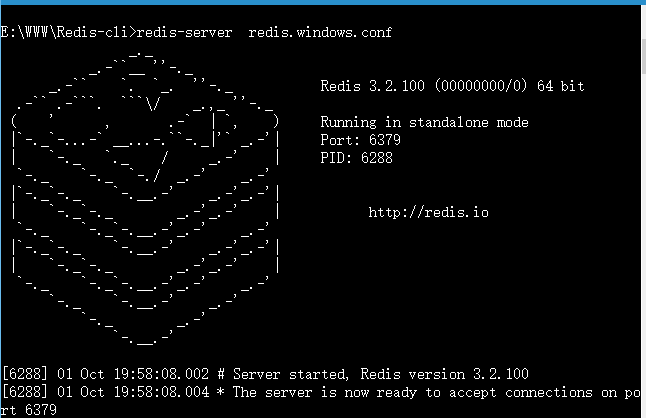
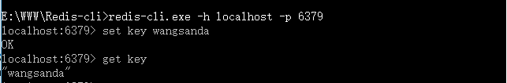
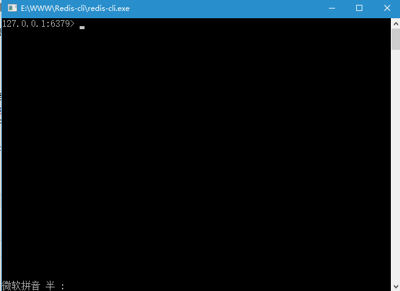
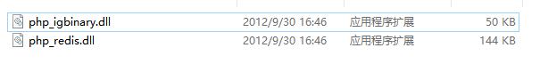
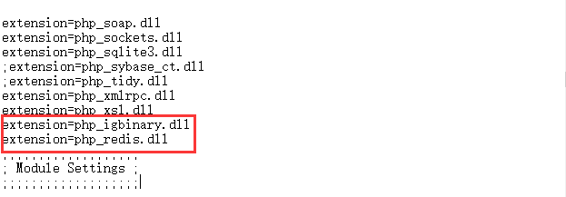
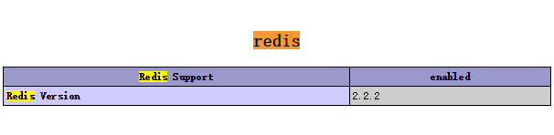
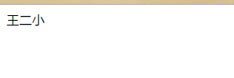

Redis是一个高性能的key-value存储系统。和Memcached类似，它支持存储的value类型相对更多，包括string(字符串)、list(链表)、set(集合)、zset(sorted set --有序集合)和hash（哈希类型）。由于Redis在存储功能上的强大，它多用于一些缓存机制、队列、订阅等场景。我们这篇文章就简要介绍下Redis在windows系统上的安装和应用，以及在windows系统上用PHP对Redis的一些简单操作。

<!--more-->

## windows下redis安装 ##

&nbsp;&nbsp;&nbsp;&nbsp;首先我们需要下载一个Redis在windows系统上的安装文件。github地址：[Redis在windows下的安装文件][1]根据自己的系统选择下载，解压打开后得到如下文件结构：

&nbsp;&nbsp;&nbsp;&nbsp;然后我们把这些文件移动到我们所想要移动的文件夹下，`ctrl+R`输入`cmd`打开`cmd`命令窗口，切换到我们磁盘中对应的`redis`目录下，键入`redis-server redis.windows.conf` 然后回车，弹出下图提示，则证明启动成功。

## windows下cmd操作redis ##

windows下调出redis cmd命令操作有两种方式：

第一种：调出cmd，找到redis文件位置，键入redis-cli.exe -h localhost -p 6379  **回车**，运行成功如下图所示：

第二种：相比较第一种就来的简单了，直接到redis所在的文件夹下，双击redis-cli.exe文件，会出现以下窗口，证明运行成功

## PHP-redis之安装扩展 ##

### 如何找正确的redis扩展？

首先看两个参数，打开页面版的phpinfo

搜索`extension Build`找到这个配置对应的信息。比如我的是：`API320190902,TS,VC15`，注意TS和VC15两个参数

打开redis版本库地址：[http://windows.php.net/downloads/pecl/releases/redis/][6]，找到与当前php版本对应的redis版本

php_redis-5.3.1-7.4-ts-vc15-x64.zip

我本地php版本是7.4，系统是64位，`phpinfo`中的`extension build`中的两个参数是`TS`和`VC15`，对比来看就是我选中的这个。

回归正题，php5版本对应的redis下载成功后，解压获得如图两个文件（php7+ 下载的redis解压后只有一个`php_redis.dll`文件，按照下面相同的方法配置，因为没有`php_igbinary.dll`，所以并不需要引入。），把这两个文件移动到php的ext目录下

&nbsp;&nbsp;&nbsp;&nbsp;移动完成后顺势在当前文件夹后退一格的目录下，找到php.ini文件，在引用扩展处加上这两个.dll的引用，具体下图：(**这里说一下，引入的时候一定要把前面的分号去掉**)

重启apache，网页上打开php的配置(**php代码中写入phpinfo()运行即可**)搜索redis会查询到redis的相关信息则说明php-redis扩展安装成功;

## PHP-redis之代码操作 ##

&nbsp;&nbsp;&nbsp;&nbsp;在以上的php-redis扩展安装成功后，就可以使用php语言来操作redis了，具体代码操作如下：

    <?php

      //php操作redis简单示例

      $redis = new Redis();

      $redis->connect('127.0.0.1', 6379);

      $redis->set('name', '王二小');

      echo $redis->get('name');

页面输出：

&nbsp;&nbsp;&nbsp;&nbsp;这样，以上redis在windows下的简单操作就完结了，网上不乏类似的文章，为了不让自己以后用到的时候辛辛苦苦去找，干脆自己整理一下，随时查看起来也方便；

## 总结 ##

 1. 第一个坑：在用cmd操作redis的时候，之前那个开启redis服务的cmd窗口不能关闭哦，关闭意味着把redis服务也关闭了；

 2. 第二个坑：在下载php-redis扩展包的时候要下载和自己php版本相同的redis包，不然也启动不了；

 3. 第三个坑：引用redis扩展的时候一定记得把extension前面的分号去掉，不然就表示没引用咯；

 4. 第四个坑：就当温馨提醒吧：步骤也不多，一步一步走，一蹴而就出了错误也不好排查不是；

## 附录 ##

参考文章：

 1. [redis详解及windows下的安装与简单使用——PHP程序员的笔记][13]

 2. [windows下安装redis——yun007][14]

 3. [windows下安装redis出现的问题以及解决办法——铁锚][15]
