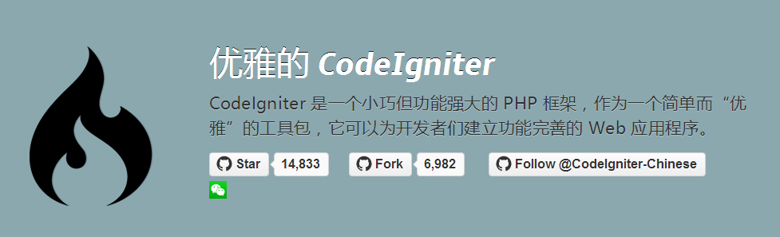
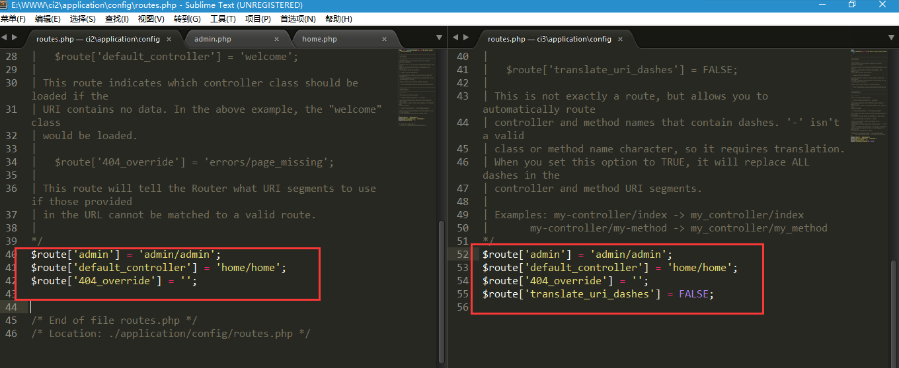
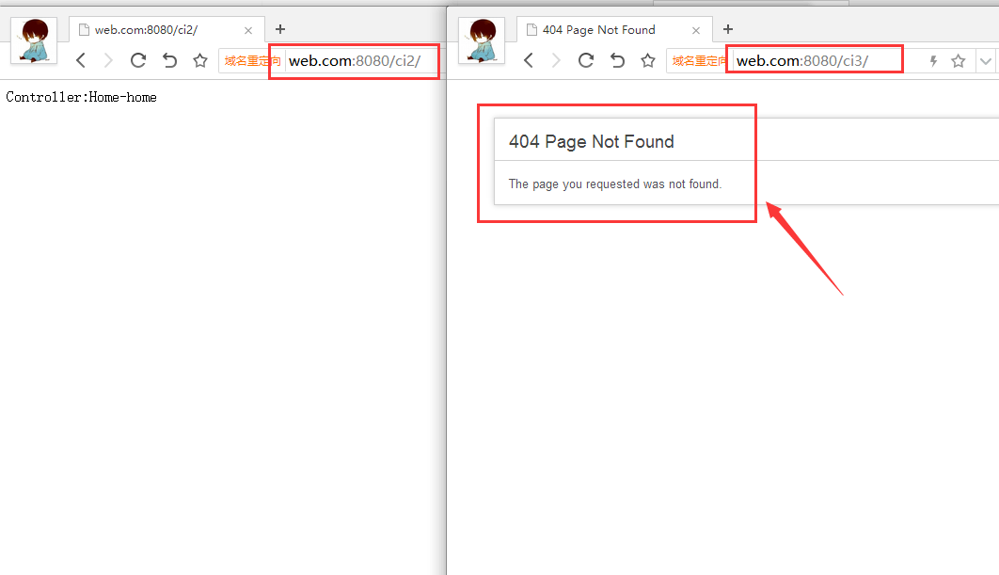
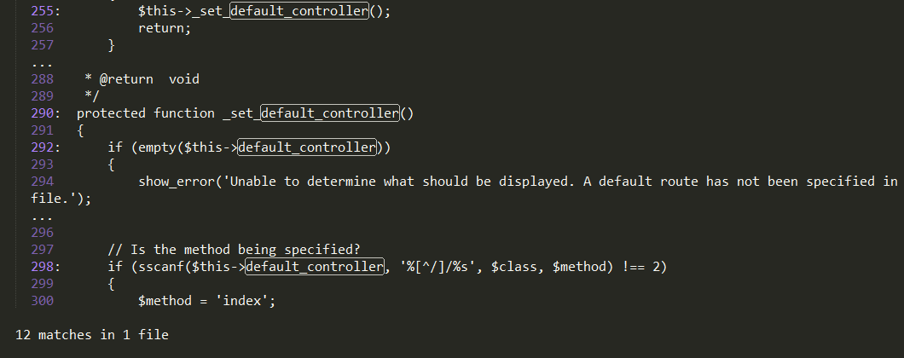
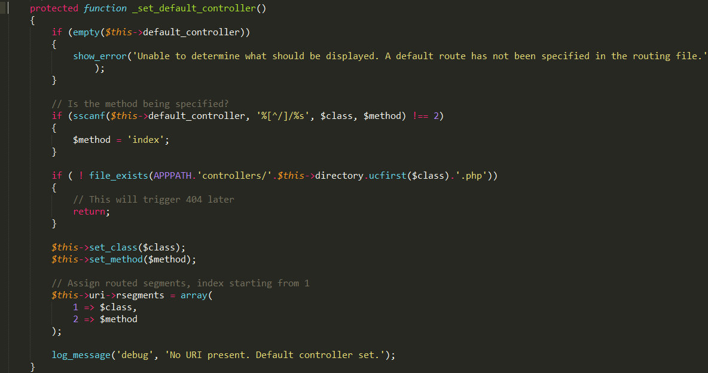

<!--more-->

[Meting autoplay="true"]

[Music server="xiami" id="82474" type="song"/]

[/Meting]

&nbsp;&nbsp;&nbsp;&nbsp;在框架中配置文件`多目录`、`前后台`应该是个很常见的事情。像一般的php框架(`CI`、`Tp`等)采用都是[单一入口][2]模式，或许有人会直接在框架根目录新建文件`admin.php`，然后改变框架`app`结构，以达到访问不同入口文件名获得不同资源的效果。那么在`CI`中一样可以这样做，不过个人觉得这种方法太浪费资源(`占用了几十k的资源吧`)。于是在‘求学问道’的途中，终于得到了比较完美的解决方法。

## 业务需求 ##

环境：[codeigniter 3][3]

需求：在`CI3`中实现前后台的效果。例：


> 地址栏输入`xxx.com`默认访问前台主页，输入`xxx.com/admin`访问后台


## 所遇问题 ##

依照惯例，我们会在框架中的`config/route.php`路由配置文件中配置我们的前后台访问路径：


```

// path => application/config/route.php


$route['admin'] = 'admin/admin'; //后台路径

$route['default_controller'] = 'home/home'; // 默认前台路径

$route['404_override'] = '';

$route['translate_uri_dashes'] = FALSE;

```


一般来说，我们这样配置是没问题的，但是有一个条件就是在`CI3`以下的版本中是没任何问题。但是目前的`框架版本`是`CI3`,所以就会出现找不到资源文件的情况，空口无凭不算，下面是两张`CI2`和`CI3`的route的配置图，和浏览器效果图：


### CI2和CI3相同路由配置对比图： ###





### CI2和CI3相同路由配置运行网页对比图： ###





由上述两图可以看到，相同的路由配置下，但是结果却是不一样。因为`CI3`已经不支持设置子目录下的控制器为默认控制器的功能。但是要完成需求描述，这样的效果该如何实现呢？接下来看我们追踪`CI3`源码;


## 源码追踪core/Route.php ##


通过上面的结论，我们应该可以联想到出现**404**这样的报错，应该是解析`default_controller`的时候出现的问题，于是我在`sublime`中利用`全文检索`查询哪里有用到`default_controller`，搜索的范围可以假定为在`CI`的`核心目录`中，因为路由的解析一般是由**核心目录里的路由类**完成的，于是查询范围锁定在`system目录`，得出下面的结果：





锁定`_set_default_controller`方法





于是我一步一步排查，最终发现是这一段代码的问题：

```

// Is the method being specified?

if (sscanf($this->default_controller, '%[^/]/%s', $class, $method) !== 2)

{

	$method = 'index';

}


if ( ! file_exists(APPPATH.'controllers/'.$this->directory.ucfirst($class).'.php'))

{

	// This will trigger 404 later

	return;

}

```


上面的代码第一段`if`里面拆分我们在`config/route.php`里配置好的`default_controller`值得到`控制器名并赋值给变量class`和`方法名并赋值给method`，如果`method`为空则默认为`index`，很显然这与我们的初衷不相符，因为我们的计划是`default_controller`里的值`home/home`，第一个`home`是目录名(`floder_name`)，第二个home才是控制器名字(`controller_name`)


而第二段`if`的意思是判断控制器文件是否存在，排查也发现控制器名竟然**不存在**，打印


> APPPATH . 'controllers/' . $this->directory . ucfirst($class) . '.php'

得到：`E:\WWW\ci3\application\controllers/Home.php`，这显然与我们的实际目录不相符，我们的实际目录应该是`E:\WWW\ci3\application\controllers/home/Home.php`,锁定这两个问题之后，就可以思考如何修正这里了，刚开始对这个地方的改动想法是这样的：


 1. 假定设置默认的控制器值为Home/home/index(目录名/控制器名/方法名)的形式

 2. 修改`core/Route.php`源码中的`_set_default_controller`方法，截取`default_controller`的值进行处理


修改`_set_default_controller`方法如下：


```

protected function _set_default_controller()

{

	if (empty($this->default_controller))

	{

		show_error('Unable to determine what should be displayed. A default route has not been specified in the routing file.');

	}


	/**

	 * if里为自己修改的部分

	 * 1.截取default_controller为数组

	 * 2.如果default_controller_arr大于3 表示是默认控制器过来的

	 * 3.赋值相应的变量

	 */

	$default_controller_arr = explode('/', $this->default_controller);

	if(count($default_controller_arr) == 3) {

		// 赋值控制器所在目录

		$this->directory = trim($default_controller_arr[0], '/') . '/';

		// 赋值控制器名

		$class = $default_controller_arr[1];

		// 因为这里计划约定默认控制器输入完整uri 即目录名/控制器名/方法名的形式

		// 所以方法名这里一定不为空

		$method = $default_controller_arr[2];


	}else {

		// Is the method being specified?

		if (sscanf($this->default_controller, '%[^/]/%s', $class, $method) !== 2)

		{

			$method = 'index';

		}

	}

	if ( ! file_exists(APPPATH.'controllers/'.$this->directory.ucfirst($class).'.php'))

	{

		// This will trigger 404 later

		return;

	}


	$this->set_class($class);

	$this->set_method($method);


	// Assign routed segments, index starting from 1

	$this->uri->rsegments = array(

		1 => $class,

		2 => $method

	);


	log_message('debug', 'No URI present. Default controller set.');

}

```


虽说这样修改测试成功了，但是觉得并不是最好的解决办法(`修改源码一般是最后的解决手段`)，于是求助`codeigniter中国`的官方微信群的小伙伴，在群里和`Hex`(手动`@Hex`)老大讨论了一下这个功能的解决方案，最终在他的帮助下得到了比较完美的解决方法，就是要在`application/core`里新建一个自己的扩展路由类`MY_Router.php`，然后定义自己的`_set_default_controller`方法，代码如下，顺便贴上自己上面设想的解决方法：

```

<?php

defined('BASEPATH') OR exit('No direct script access allowed');


class MY_Router extends CI_Router {


	/**

	 * 个人认为比较完美解决问题的方法

	 */

    protected function _set_default_controller() {

         

        if (empty($this->default_controller)) {

            

            show_error('Unable to determine what should be displayed. A default route has not been specified in the routing file.');

        }


        if (sscanf($this->default_controller, '%[^/]/%s', $class, $method) !== 2) {

            $method = 'index';

        }


        /**

         * 1.判断目录是否存在

         * 2.如果存在 调用设置控制器目录方法 详细参考system/core/Route.php set_directory方法

         * 3.接着再把method拆分 赋值给$class $method $method为空则设置为index

         */

        if( is_dir(APPPATH.'controllers/'.$class) ) {

             

            // Set the class as the directory

            $this->set_directory($class);

            

            // $method is the class

            $class = $method;

            

            // Re check for slash if method has been set

            if (sscanf($method, '%[^/]/%s', $class, $method) !== 2) {

                $method = 'index';

            }

        }


        if ( ! file_exists(APPPATH.'controllers/'.$this->directory.ucfirst($class).'.php')) {

            // This will trigger 404 later

            return;

        }


        $this->set_class($class);

        $this->set_method($method);


        // Assign routed segments, index starting from 1

        $this->uri->rsegments = array(

            1 => $class,

            2 => $method

        );

        log_message('debug', 'No URI present. Default controller set.');

    }


    /**

     * @author 命中水、 

     * @date(2017-8-7)

     * 

     * 使用这个方法时 把这个方法名和上面的方法名调换一下 

     * application/config/route.php default_controller的值写uri全称(目录名/控制器名/方法名) 即可

     * 因为最终Route.php路由类库调用的还是_set_default_controller方法

     */

    protected function _set_default_controller_me() {

         

        if (empty($this->default_controller))

		{

			show_error('Unable to determine what should be displayed. A default route has not been specified in the routing file.');

		}


		/**

		 * if里为自己修改的部分

		 * 1.截取default_controller为数组

		 * 2.如果default_controller_arr大于3 表示是默认控制器过来的

		 * 3.赋值相应的变量

		 */

		$default_controller_arr = explode('/', $this->default_controller);

		if(count($default_controller_arr) == 3) {

			// 赋值控制器目录

			$this->directory = trim($default_controller_arr[0], '/') . '/';

			// 赋值控制器名

			$class  = $default_controller_arr[1];

			// 因为这里计划约定默认控制器输入完整uri 即目录名/控制器名/方法名的形式

			// 所以方法名这里一定不为空

			$method = $default_controller_arr[2];


		}else {

			if (sscanf($this->default_controller, '%[^/]/%s', $class, $method) !== 2)

			{

				$method = 'index';

			}

		}

		if ( ! file_exists(APPPATH.'controllers/'.$this->directory.ucfirst($class).'.php'))

		{

			// This will trigger 404 later

			return;

		}


		$this->set_class($class);

		$this->set_method($method);


		// Assign routed segments, index starting from 1

		$this->uri->rsegments = array(

			1 => $class,

			2 => $method

		);


		log_message('debug', 'No URI present. Default controller set.');

    }


}

```


以上代码比较完美的那个，亲测有效！！！(自己的这个简单测试了一下，也可以使用)


## 资源 ##

### 参考文章 ###


 1. [How to select default controller in subfolder?][8]

 2. [How to use a sub folder in default controller route in CodeIgniter 3][9]

### 资源 ###

 1. [MY_Route.php][10]

 2. ，[`CodeIgniter`中国微信群][11]
