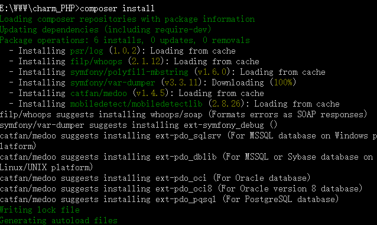

# charm_PHP

## 介绍 ##

一个简单的MVC框架，框架中实现了C和V层，M层使用composer的PHP组件——[Medoo](https://packagist.org/packages/catfan/medoo "medoo")，实现了一些简单的设计模式，单一入口、自动加载。

本框架遵循[PSR规范](https://www.cxiansheng.cn/server/293 "PSR")，使用[命名空间](http://www.php.net/manual/zh/language.namespaces.rationale.php "namespace")来规范类于类之间的互相合作；

<!--more-->

[Meting autoplay="true"]

[Music server="xiami" id="1771371091" type="song"/]

[/Meting]

## 目录 ##

    app -> 应用目录

        controller -> 控制器目录

    	core       -> 公共、核心文件目录

		views      -> 视图目录

    resource  -> 资源目录(js、images、css等)

    system

		config	   -> 框架配置文件目录

		core	   -> 框架核心文件目录

			Charm.php    -> 核心文件

			Common.php   -> 公共方法

			Cofig.php    -> 配置类

			Core.php     -> 核心文件

			Log.php      -> 日志类

			Model.php    -> 数据库类

			Page.php     -> 分页类

			Route.php    -> 路由类

			Security.php -> 验证类

			Session.php  -> session类

		dirves     -> 驱动文件目录

	vendor  -> PHP组件

## 初始化 ##

1. 本地下载项目：git clone https://github.com/charm-v/charm_PHP.git

2. 打开cmd，在项目下输入 `compoer install`

3. 运行框架

## 全局方法 ##

### model() ###

Use: `$model =& model();`

### post($key) ###

Use: `$postData = post();  OR $name = post('name');`

### get($key) ###

Use: `$getData = get();  OR $name = get('name');`

### request($key, $type = 'get') ###

Use:

 

	$getName     = request('name', 'get');

	$posttName   = request('name', 'POST');`

	$requestName = request('name', 'request');`

### ajaxReturn($status, $msg = '') ###

Use:

    1、`ajaxReturn(200, 'ok'); => {'status':200, 'msg':'ok'}`

	

	2、$returnData = [

		'state'   => 400,

		'message' => 'error',

		'data'    => []

	];

	ajaxReturn($returnData); => {'state':400, 'error':'ok','data':[]}

### view($viewName, $data = []) ###

Use:

 

	view('home');

	view('home', ['content' => '内容']);

### css($cssName, $cssPath = 'css', $resource = 'resource') ###

Use:

 

	css('main.css'); 

	==> <link rel="stylesheet" type="text/css" href="http://charm_PHP.com/resource/css/main.css" media="all" />

	

	css('main.css', 'css/home')

	==> <link rel="stylesheet" type="text/css" href="http://charm_PHP.com/resource/css/home/main.css" media="all" />

### js($jsName, $jsPath = 'css', $resource = 'resource') ###

Use:

 

	css('main.js'); 

	==> 

	

	......

### base_url($uri = '') ###

Use:

	base_url(); 

	==> http://charm_PHP.com

	

	base_url('index/getUserList'); 

	==> http://charm_PHP.com/index/getUserList

### redirect($uri, $flag = false) ###

Use:

	redirect('index/editUserInfo'); 

	==> Location: http://charm_PHP.com/index/editUserInfo

	redirect('baidu.com'); 

	==> Location: http://baidu.com

	redirect('https://google.com'); 

	==> Location: https://google.com

## 类使用 ##

### Config类 ###

	use system\core\Config;

	

	// PAGENUM 配置项下标 page配置项文件名

	Config::get('PAGE_NUM', 'page');

### Log类 ###

	use system\core\Log;

	

	// PAGENUM 配置项下标 page配置项文件名

	Log::log($data, $fileName);

### Page类 ###

	use system\core\Config;

	use system\core\Page;

	

	if(isset($_GET['page'])) {

        $now_page = intval($_GET['page']) ? intval($_GET['page']) : 1;

    }else {

        $now_page = 1;

    }

    // 取得配置项每页条数

    $pageNum           = Config::get('PAGE_NUM', 'page');

    // 计算偏移量

    $offset            = $pageNum * ($now_page - 1);

    $data['count']     = parent::$model->count(table, $where);

    $where['LIMIT']    = [$offset, $pageNum];

    $data['orderData'] = parent::$model->select('table', '*', $where);

    

    // 分页处理

    $objPage           = new page($data['count'], $pageNum, $now_page, '?page={page}' . $parameter);

    $data['pageNum']   = $pageNum;

	

	// 生成分页代码

    $data['pageList']  = $objPage->myde_write();

## 依赖组件 ##

- [Medoo](https://packagist.org/packages/catfan/medoo "medoo")

- [var-dumper](https://packagist.org/packages/symfony/var-dumper "dump")

- [whoops](https://packagist.org/packages/filp/whoops "whoops")

## gitHub地址 ##

 - [Charm_PHP][1]

## 结语 ##

这个小框架，被我一直用作一些小型的外包项目中，暂时还没有发现什么很严重的错误，估计是黑客好心，看到这个项目这么烂不忍心黑？嗯...有时间的话还是很想补充、完善一下这个框架的。

对了，这个小框架的原型是我在慕课网的一节课程中学习到的，自己敲出来后，然后就拿来自己用啦，注明一下课程的地址，想学习的小伙伴可以去学习一下：[从零开始打造自己的PHP框架][2]。，嗯，就先介绍到这里啦
