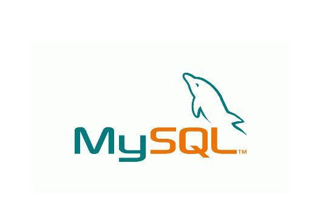
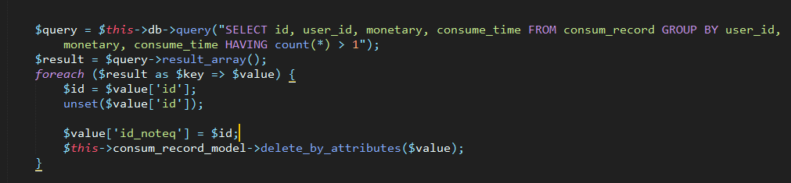
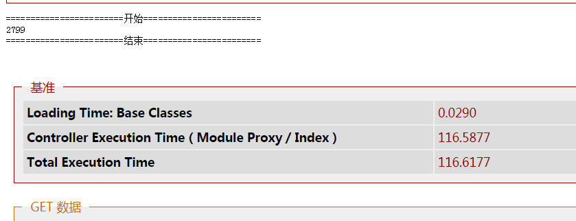
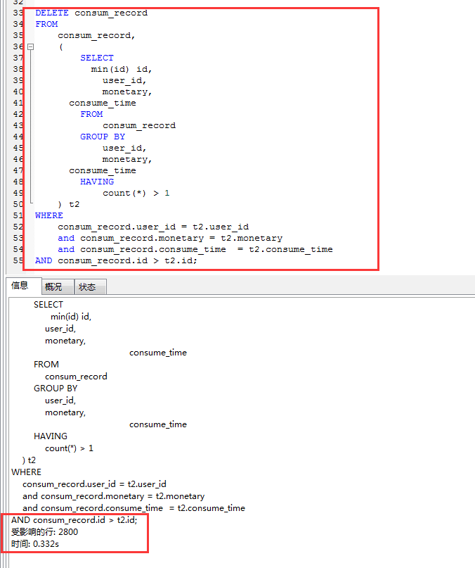

&nbsp;&nbsp;&nbsp;&nbsp;前几天在做一个需求的时候，需要清理mysql中重复的记录，当时的想法是通过代码遍历写出来，然后觉得太复杂，心里想着应该可以通过一个sql语句来解决问题的。查了资料，请教了大佬之后得出了一个很便利的sql语句，这里分享下这段sql语句和思路。


<!--more-->


[Meting]

[Music server="netease" id="227724" type="song"/]

[/Meting]


## 需求分析 ##


>  数据库中存在重复记录，删除保留其中一条（是否重复判断基准为多个字段）


## 解决方案 ##


碰到这个需求的时候，心里大概是有思路的。最快想到的是可以通过一条sql语句来解决，无奈自己对于复杂sql语句的道行太浅，所以想找大佬帮忙。

### 找人帮忙 ###

因为这个需求有点着急，所以最开始想到的是，可以找这方面的同行来解决，然后分享这个问题给[@赵七七][2]同学，结果这货随便百度了一下，就甩给我一个从未用过的sql语句，让我自己尝试，心里万匹那啥啥啥奔腾而过...


### 自己百度 ###

找到了一条sql语句：

```

DELETE

FROM

    vitae a

WHERE

    (a.peopleId, a.seq) IN (

        SELECT

            peopleId,

            seq

        FROM

            vitae

        GROUP BY

            peopleId,

            seq

        HAVING

            count(*) > 1

    )

AND rowid NOT IN (

    SELECT

        min(rowid)

    FROM

        vitae

    GROUP BY

        peopleId,

        seq

    HAVING

        count(*) > 1

)

```

这条语句是在[【MySQL中删除重复数据只保留一条】][3]这篇文章里找到的。这条sql思路很明显，有以下3步：


 1. `SELECT peopleId, seq FROM vitae GROUP BY peopleId, seq HAVING count(*) > 1`查询出表中重复记录作为条件

 2. `SELECT min(rowid) FROM vitae GROUP BY peopleId, seq HAVING count(*) > 1`查询出表中重复记录中ID最小的值为第二个条件

 3. 最后根据以上两个条件，删除**除**重复记录中最小ID的其余重复记录


但是很无奈的是，运行这条语句出现了错误，大致报错意思是，不能在查询的时候同时更新这个表。


### 代码解决 ###


根据上面这个sql语句想到或许可以通过代码的方式，两步来达到同样的目的：


 1. 先取出重复的数据集

 2. 根据查询到的数据集，循环删除其余的重复数据


想法是有了，写出来也很快，但是一运行吓我一跳，竟然需要**116s**左右，然后自己就想一定要找到可以使用的sql语句，贴一下代码和运行结果：








### 完美的【去重留一】SQL ###


最后在一个技术群里得到了完美的答案，看这条sql语句：

```

DELETE consum_record

FROM

    consum_record, 

    (

        SELECT

        	min(id) id,

            user_id,

            monetary,

			consume_time

        FROM

            consum_record

        GROUP BY

            user_id,

            monetary,

			consume_time

        HAVING

            count(*) > 1

    ) t2

WHERE

    consum_record.user_id = t2.user_id 

    and consum_record.monetary = t2.monetary

    and consum_record.consume_time  = t2.consume_time

AND consum_record.id > t2.id;

```


上面这条sql语句，仔细看一下，揣摩出思路也不难，大概也分为3步来理解：


 1. `(SELECT min(id) id, user_id, monetary, consume_time FROM consum_record GROUP BY user_id, monetary, consume_time HAVING count(*) > 1 ) t2` 查询出重复记录形成一个集合（临时表t2），集合里是每种重复记录的最小ID

 2. `consum_record.user_id = t2.user_id and consum_record.monetary = t2.monetary and consum_record.consume_time  = t2.consume_time` **关联**判断重复基准的字段

 3. 根据条件，删除原表中id大于t2中id的记录


看到这个语句的时候，心里想这也太厉害了。这么一个简单的sql语句，竟然可以解决这么复杂的问题，涨姿势了~

运行起来也超级快，原先的代码循环执行，需要**116s**左右，而这里**0.3s**就可以了，厉害了~





## 总结 ##

作为一个php程序猿，按理来说sql这里是不能拖后腿的，无奈实际中，需要照顾的事情太多，现在的sql水平也只是处于在一个普通的层次中，以后找机会一定要补一下这方面的知识。


## 资源 ##

为了方便小伙伴测试，已经把这个数据表传上来了，有mysql工具的话，导入即可。[consume_record.sql][7]

今天就分享到这里啦。
