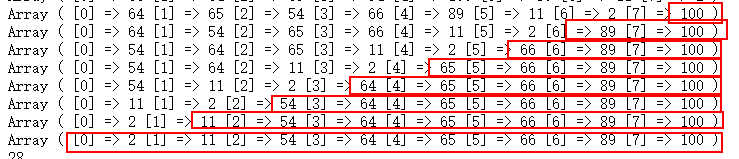

&nbsp;&nbsp;&nbsp;&nbsp;自己之前对于排序的使用一直都是来自于对`sort`,`ksort`等排序函数的基础上，但是对具体的算法原理没有具体考虑过。闲下来，就思考下这些算法的实现。那么本篇文章以及未来的一系列排序文章，将总结排序在php中的原理以及实现：


<!--more-->


## 冒泡排序 ##


[冒泡排序][1]算是排序中最基本、也最容易理解的排序算法了。以下引自百度百科：


> 冒泡排序（Bubble Sort），是一种计算机科学领域的较简单的排序算法。

它重复地走访过要排序的数列，一次比较两个元素，如果他们的顺序错误就把他们交换过来。


> 走访数列的工作是重复地进行直到没有再需要交换，也就是说该数列已经排序完成。


> 这个算法的名字由来是因为越大的元素会经由交换慢慢“浮”到数列的顶端，故名。


先贴一下冒泡排序的代码，再逐一分析其中的奥妙（这里以从小到大排序为例）：


## 冒泡代码 ##

```

$numbers = [66, 64, 65, 54, 100, 89, 11, 2];

$len = count($numbers);

for ($i = 0; $i < $len; $i++) {

    for ($j = 0; $j < $len - $i - 1; $j++) {

        if ($numbers[$j] > $numbers[$j + 1]) {

            $temp = $numbers[$j];

            $numbers[$j] = $numbers[$j + 1];

            $numbers[$j + 1] = $temp;

        }

    }

}

```

## 原理分析 ##

短短数行代码就可以实现冒泡排序，但其中的原理并不简单，简单归纳为一下几点：


 1. 第一次拿下标为0和下标为1的元素进行比较

 2. 每次拿相邻的两个元素进行比较，根据排序规则，进行顺序调换；比如从小到大排序，则每次在比较相邻两个元素大小的时候，把元素小的那一方提到原先元素大的那一方的下标上，把元素大的那一方提到原先元素小的那一方下标上；

 3. 两两一对，每一对都进行比较

 4. 最外围的for循环，每一次循环完毕都能得到当前循环组里的最大值，在数组末尾依次排列


## 代码分解 ##


我们可以先看一下内层for循环，第一次循环完毕的结果：

```

// 原先的数组：

Array ( [0] => 66 [1] => 64 [2] => 65 [3] => 54 [4] => 100 [5] => 89 [6] => 11 [7] => 2 ) 


// 第二层for循环第一次循环，每次的结果

Array ( [0] => 64 [1] => 66 [2] => 65 [3] => 54 [4] => 100 [5] => 89 [6] => 11 [7] => 2 ) 

Array ( [0] => 64 [1] => 65 [2] => 66 [3] => 54 [4] => 100 [5] => 89 [6] => 11 [7] => 2 ) 

Array ( [0] => 64 [1] => 65 [2] => 54 [3] => 66 [4] => 100 [5] => 89 [6] => 11 [7] => 2 ) 

Array ( [0] => 64 [1] => 65 [2] => 54 [3] => 66 [4] => 100 [5] => 89 [6] => 11 [7] => 2 ) 

Array ( [0] => 64 [1] => 65 [2] => 54 [3] => 66 [4] => 89 [5] => 100 [6] => 11 [7] => 2 ) 

Array ( [0] => 64 [1] => 65 [2] => 54 [3] => 66 [4] => 89 [5] => 11 [6] => 100 [7] => 2 ) 

Array ( [0] => 64 [1] => 65 [2] => 54 [3] => 66 [4] => 89 [5] => 11 [6] => 2 [7] => 100 )

```

从上面的执行结果中我们可以看到，第一行结果相比较最初的数组而言，两两比较，元素小的那一个已经提到了前面，这里验证了我们【**原理分析**】里第一点和第二点的描述；而且我们也得到了最大值，在数组的末尾。


第一层循环结束后，我们仍然看到数组的排序不是从小到大的顺序，所以要进行第二次元素排序；


由于每次内层for循环完毕后已经确定了最大值，所以在外围for循环第一次之后每次的排序后，都不需要再对确定好的最大值进行比较，所以有了内层循环中`$j < $len - $i - 1`这段代码，来看一下外层循环每次循环之后的结果：





结果我们可以验证**内层循环**，每次循环完毕都能确定最大值的说法；


```

if ($numbers[$j] > $numbers[$j + 1]) {

    $temp = $numbers[$j];

    $numbers[$j] = $numbers[$j + 1];

    $numbers[$j + 1] = $temp;

}

```

这段代码块起到交换两个元素的作用，如果元素1大于元素2，那么用一个临时变量把其中一个值存储在临时变量中，再进行下标元素的替换工作；


## 封装 ##


下面代码块封装了冒泡排序正序、倒序的实现；

```

/**

 * 冒泡排序（asc正序列 desc倒序）

 * @param  array  $arr      排序数组

 * @param  string $sortType 排序类型

 * @return array            排序结果

 */

function bubbleSort($arr, $sortType = 'asc')

{

    $intLength = count($arr);

    for ($i = 0; $i < $intLength; $i++) {

        for ($j = 0; $j < $intLength - $i - 1; $j++) {

            // 正序排序

            if ($sortType == 'asc') {

                // 交换元素位置

                if ($arr[$j] > $arr[$j + 1]) {

                    $temp        = $arr[$j];

                    $arr[$j]     = $arr[$j + 1];

                    $arr[$j + 1] = $temp;

                }

            // 倒序排序

            } else {

                // 交换元素位置

                if ($arr[$j] < $arr[$j + 1]) {

                    $temp        = $arr[$j];

                    $arr[$j]     = $arr[$j + 1];

                    $arr[$j + 1] = $temp;

                }

            }

        }

    }


    return $arr;

}

$arrTmp = [66, 64, 65, 54, 100, 89, 11, 2];

p(bubbleSort($arrTmp));

p(bubbleSort($arrTmp, 'desc'));

```


## 总结 ##

冒泡排序是排序算法中的基本，之前自己在学习C语言的时候，有幸接触到算法的相关知识。觉得算法乃是一门博大精深的学问，后面几章也会连续做排序算法的讲解；下章将介绍冒泡排序的兄弟——【**[快速排序][3]**】。

完。
