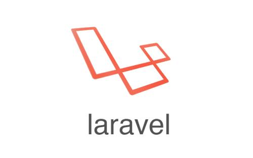

衔接之前文章，继续学习，做笔记。


 1. [Laraver学习笔记—框架基本介绍][2]

 2. [Laravel学习笔记—数据库操作的三种方式][3]


<!--more-->


## Artisan命令 ##


### Artisan简介 ###


 - Artisan是Laravel中自带的命令行工具的名称

 - 由强大的Symfony Console组件驱动

 - 提供对应用开发帮助的命令


### Artisan使用 ###


查看所有可用的Artisan所用命令


> php artisan || php artisan list


查看帮助信息


> php artisan help


创建控制器、模型、中间件


> php artisan make:controller TestController

> php artisan make:model Test

> php artisan make:middleware Test


生成随机的key，


> php artisan key:generate


开启维护模式和关闭维护模式（显示503）


> php artisan down

> php artisan up


生成路由缓存以及移除路由文件


> php artisan route:cache

> php artisan route:clear


### laravel中用户认证 ###

生成auth所需文件，分别会在路由、控制器、视图生成相应的文件

> php artisan make:auth


数据迁移

> php artisan migrate


报错：

```

SQLSTATE[42000]: Syntax error or access violation: 1071 Specified key was too long; max key length is 1000 bytes (SQL: alter table `users` add unique `users_email_unique`(`email`))

```

原因：


> 这是由于Laravel 默认使用 utf8mb4 字符， 包括支持在数据库存储「 表情」 。 如果你正在运行的 MySQL release 版本低于5.7.7 或 MariaDB release版本低于10.2.2  


解决


> 为了MySQL为它们创建索引，你可能需要手动配置迁移生成的默认字符串长度， 你可以通过调用 AppServiceProvider 中的Schema::defaultStringLength 方法来配置它


找到`app\Providers\AppServiceProvider.php`文件


 1. 在头部引入`use Illuminate\Support\Facades\Schema`;

 2. 并在boot方法里增加`Schema::defaultStringLength(191)`;


再次执行`php artisan migrtate`即可成功；


## 数据迁移 ##

新建表迁移文件


> php artisan make:migration create_tests_table --create=test

> --create 指定数据表名称


数据迁移文件增加字段示例，在迁移文件up方法中增加字段：

```

    public function up()

    {

        Schema::create('student', function (Blueprint $table) {

            $table->increments('id');

            $table->string('name');

            $table->integer('age')->unsigned()->default(0);

            $table->integer('sex')->unsigned()->default(1);

            $table->integer('created_at')->default(0);

            $table->integer('updated_at')->default(0);

        });

    }

```


生成模型同时生成迁移文件

> php artisan make:model Test -m


回滚上一次迁移


> php artisan migrate:rollback


回滚所有迁移


> php artisan migrate:reset


### 数据填充 ###

创建一个填充文件，并完善填充文件


> php artisan make:seeder StudentTableSeeder


执行单个填充文件


> php artisan db:seed --class=StudentTableSeeder


批量执行填充文件


> php artisan db:seed


示例1：在数据填充文件 student(`database\seed\StudentTableSeeder.php`)文件中增加如下代码:

```

在头部引入 use Illuminate\Support\Facades\DB;

修改run方法，增加要插入的数据内容：

    public function run()

    {

        //

        DB::table('student')->insert([

        	[

        		'name' => '小明',

        		'age'  => '18'

        	],

        	[

        		'name' => '小红',

        		'age'  => '16'

        	],

        ]);

    }

```

执行单个填充文件命令


> php artisan db:seed --class=StudentTableSeeder


示例2：批量填充

在相同目录下打开DatabaseSeeder.php，在run方法中增加要批量填充的表名数据，如下代码：

```

    public function run()

    {

        this->call(UsersTableSeeder::class);

        this->call(StudentTableSeeder::class);

    }

```

执行`php artisan db:seed` 即可。
