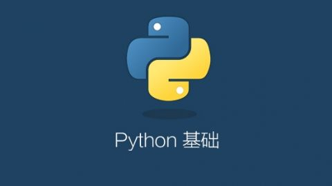

python基础学习笔记。语法、函数等。

<!--more-->


## 基础

1. 定义utf-8文件头

```
#!/usr/bin/env python3
# -*- coding: utf-8 -*-
```

2.循环
```
// name是值  names是数组

// 第一种写法
names = ['Michael', 'Bob', 'Tracy']
for name in names:
    print(name)
    
// 第二种写法
for x in [1, 2, 3, 4, 5, 6, 7, 8, 9, 10]:
    print(x)
```

3.内置字典

**dict**
```
//定义一个dict
d = {'xiaoming': 95, 'xiaohong': 76}

// 像php数组一样的方式 通过下标获取值
print(d['xiaohong'])


// 通过get获取下标对应的值  get两个参数 第一个参数key 第二个参数为key不存在时的默认值
score = d.get('1');

if (score == None):
    print('key不存在')

score = d.get('1', 1);

print(score);

d.pop('xiaohong') // 根据key删除一个元素
```

和list比较，dict有以下几个特点：
1. 查找和插入的速度极快，不会随着key的增加而变慢；
2. 需要占用大量的内存，内存浪费多。

而list相反：
1. 查找和插入的时间随着元素的增加而增加；
2. 占用空间小，浪费内存很少。

**set**
```
# 创建一个set 必须使用list作为输入集合
s = set([1, 2, 3])
print(s)

# add增加一个key
s.add('s')
print(s)

# remove删除一个key
s.remove(1);
print(s)

# & 获取两个set交集
s2 = set([3, 2, 5])
mix = s & s2
print(mix)
```

## 函数

使用函数

```
# 函数使用
a = abs(-1)
print(a)

# 函数可以复制给一个变量 相当于函数的别名
a = abs
print(a(1.22))
```

自定义函数
```
# 定义一个函数
# 1. 自定义函数用def
# 2. 函数与括号之间无需空格
# 3. 表达式无需空
def my_max(x, y):
    # 校验参数
    if not isinstance(x, (int, float)):
        # 抛出错误
        raise TypeError('params error')
    if x > y:
        return x
    return y

print(my_max(1,2))

# 返回多个值
def return_mulit_val(x, y):
    return x,y
    
x, y = return_mulit_val(1,2)
print(x)
print(y)
```

可变参数
```
# 定义可变参数
# 参数前加*为可变参数  参数数量不规定 内部会当做一个tuple
def my_Variable(*numbers):

    print(numbers)

    sum = 0

    for number in numbers:
        sum = sum + number * number
    return sum;

print('---------------------')
print(my_Variable(1, 2, 2, 3, 4))

# 结果
---------------------
(2, 3, 4)
29


numbers = [1, 2, 3]

print('---------------------')
print(my_Variable1(*numbers)) // numbers元素每个参数作为参数传递

#结果
---------------------
(1, 2, 3)
14
```

切分`[x:y]`
```
arr = [1, 2, 3, 4, 5]
tuple = (6, 7, 8, 9, 10)

print(arr[:3])
print(tuple[:4])

# 实现trim
def trim(str, limit = ' '):
    if str == '':
        return str

    left = str[0]
    right = str[-1:]

    if left == limit:
        str = str[1:]

    if right == limit:
        # -1倒数第一个元素的索引
        str = str[:-1]

    return str

print(trim(' str '));
```

迭代

```
# 引入collections模块
from collections import Iterable 

# 通过Iterable类型判断变量是否可迭代
# isinstance判断对象类型
res = isinstance([1, 2], Iterable)
print(res)

# enumerate函数把list变成键值对
for x,y in enumerate([1, 2, 3]):
    print(x, y)
```

列表生成式
```
# 列表生成式
print(list(range(2, 12)))
# 结果
[2, 3, 4, 5, 6, 7, 8, 9, 10, 11]

lista= [x * x for x in range(1, 10)]
print(lista)
# 结果：
[1, 4, 9, 16, 25, 36, 49, 64, 81]
```

加锁释放锁
```
# 引入锁
from twisted.internet.defer import DeferredLock

lock = DeferredLock()

# 加锁
lock.acquire()

# 释放锁
lock.release()
```

### 三元运算符

```
# 如果str有值 返回str.strip 否则返回 ''
return str.strip() if str else ''
```

### 日期时间戳转换
```
import time,datetime

# 当前时间
print(time.time())

datetime_str = '2020-01-02 11:11:11'

time_array = time.strptime(datetime_str, '%Y-%m-%d %H:%M:%S')

# 日期转换为时间戳
timestamp = int(time.mktime(time_array))

print(timestamp)
```

### join
```
query_string = '&' . join('%s=%s' % (k, v) for k,v in dict.items())
```