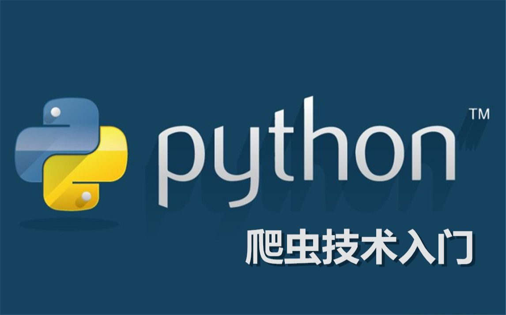

## 前言


当我们在爬取网页的时候，有部分是静态的，这种类型的网页，我们采用一般的方法就能很容易爬取到数据。但有些网页爬取的门槛还是有的，是动态的，是通过js渲染（包括ajax）出来的，这类型的网页采取一般的爬取方式就不行了，会出现爬取不到指定的数据。这时候，就要换种思路来解决了。所谓道高一尺，魔高一丈。本篇文章来介绍一下采用Splash和selenium来爬取动态网页，并对比一下两者的区别。


<!--more-->



## 版本介绍


本文中提到的各个工具的版本


 - Python `3.8.1`

 - pip `20.0.2`

 - 谷歌浏览器 `80.0.3987.132（正式版本） （64 位）`

 - 火狐浏览器 `73.0 (64 位)`


## Selenium


> Selenium是一个用于Web应用程序测试的工具。Selenium测试直接运行在浏览器中，就像真正的用户在操作一样。支持的浏览器包括IE（7, 8, 9, 10, 11），Mozilla Firefox，Safari，Google Chrome，Opera等。这个工具的主要功能包括：测试与浏览器的兼容性——测试你的应用程序看是否能够很好得工作在不同浏览器和操作系统之上。测试系统功能——创建回归测试检验软件功能和用户需求。


上面是一段来自于百度百科的解释，通过上面的解释，我们可以简单的了解到selenium的用途，没错，很容易联想到自动化测试的场景。开发者写好一个功能，那么测试者可以编写对应的测试用例，模拟浏览器来测试这个功能。（会编写自动化脚本的测试人员，据说跟普通测试人员不是一个级别的哦）


如上面百科所述，使用selenium时就像使用浏览器一样在操作，那我们通过什么样的方式来操作呢？刚好比较常用的谷歌浏览器和F火狐浏览器都提供了无头版本的浏览器


### 无头浏览器


> 无头浏览器是指可以在图形界面情况下运行的浏览器。我可以通过编程来控制无头浏览器自动执行各种任务，比如做测试，给网页截屏等。


我们可以通过浏览器提供的无头版本，来打开浏览器，使用的第一点就是首先**电脑上得安装对应的正常版本的浏览器**，然后通过代买程序来操作浏览器


火狐浏览器无头版下载地址：[https://github.com/mozilla/geckodriver/releases][2]


谷歌浏览器无头版下载地址：[http://chromedriver.storage.googleapis.com/index.html][3]


这里值得注意的是，谷歌浏览器无头版本需要下载与电脑安装的谷歌浏览器相近的版本，比方电脑上安装的谷歌浏览器版本是`79.*.*`，那么下载的无头版本也应该是`79.*.*`，大版本要一致。火狐浏览器并无此要求。


### PhantomJS

说起无头浏览器，就不得不提一下PhantomJS。


> PhantomJS是一个无界面的,可脚本编程的WebKit浏览器引擎。它原生支持多种web 标准：DOM 操作，CSS选择器，JSON，Canvas 以及SVG。


现在Python对PhantomJS的支持已经变成了Selenium，PhantomJS相关的扩展已被**废弃**。这里只作为了解。


### Python操作selenium


python也实现了selenium，通过selenium的webdriver来调用相应的浏览器进行操作，下面我们看一下，python使用selenium的简单案例：


#### 1、实现唤起浏览器并打开一个网页


```

# -*- coding: utf-8 -*-


# 引入selenium webdriver

from selenium import webdriver


# 设置浏览器类型为火狐

browser = webdriver.Firefox()


# 打开一个网址

browser.get('https://item.jd.com/100008348542.html')

```


#### 2、设置无头运行

```

# -*- coding: utf-8 -*-


# 引入selenium webdriver类

from selenium import webdriver


# 引入火狐浏览器配置类

from selenium.webdriver import FirefoxOptions


# 实例化一个配置项

options = FirefoxOptions()


# 设置无需打开浏览器

options.add_argument('--headless')


# 设置浏览器类型为火狐

browser = webdriver.Firefox(firefox_options=options)


# 打开一个网址

browser.get('https://item.jd.com/100008348542.html')


# 获取网页源码

source = browser.page_source


print(source)

```


上面`source = browser.page_source`这一行代码就是获取到的js渲染之后的网页源码。拿到源码之后就可以干你想干的事情啦


是不是操作起来很简单呢


## Splash


Splash是一个javascript渲染服务。它是一个带有HTTP API的轻量级Web浏览器，使用Twisted和QT5在Python 3中实现。QT反应器用于使服务完全异步，允许通过QT主循环利用webkit并发。

### 功能介绍


 - 并行处理多个网页

 - 获取HTML源代码或截取屏幕截图

 - 关闭图像或使用Adblock Plus规则使渲染更快

 - 在页面上下文中执行自定义JavaScript

 - 可通过Lua脚本来控制页面的渲染过程

 - 在Splash-Jupyter 笔记本中开发Splash Lua脚本。

 - 以HAR格式获取详细的渲染信息


## 参考


 - [python3之Splash][4]

 - [Python+Selenium基础入门及实践][5]
