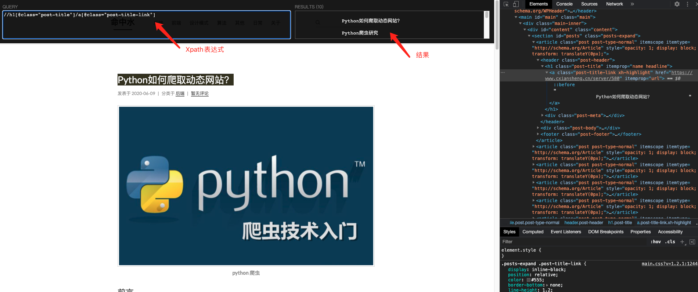
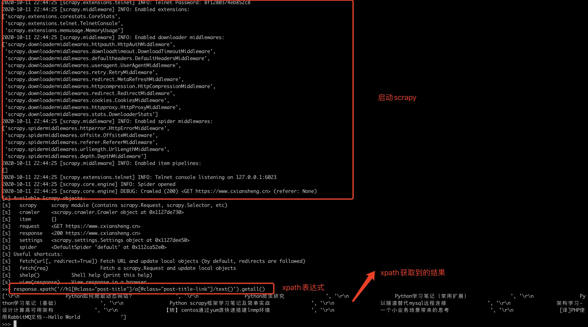

在工作中，已经陆陆续续使用爬虫做需求将近半年时间了，在这半年时间里，从一个python小白到爬虫入门，再至功能实现。从上午PHP到下午Python忙的焦头烂额到现在的PHP/Python随心切换，其中的曲折不言而喻，也着实走了不少弯路。但好在功夫不负有心人，在半年的时光里，使用Python的同时也和它一起成长。如今总结一下，希望可以帮助到有需要的同学。


## 学习篇


### python


从最开始接触爬虫，首先最需要了解的就是python的环境搭建、语法及特性，网络上有很多相关的教程，以下列举几个我在学习过程中使用到的教程，对于Python的快速入门都能起到很大的作用


-   廖雪峰老师的[Python教程](https://www.liaoxuefeng.com/wiki/1016959663602400)，最先就是在这里开启Python之旅的。一边看文章学习一边跟着写写demo

-   菜鸟教程里的[Python基础教程](https://www.runoob.com/python/python-tutorial.html)也可以作为快速学习使用

-   [Python3文档](https://docs.python.org/zh-cn/3/)，在忘记一些函数的时候可以很快速的找到


<!--more-->


### 爬虫框架


等到Python的基础语法了解的差不多的时候，就可以开始着手学习python相关的爬虫框架了。Python的爬虫框架，其中比较著名的就是[Scrapy](https://scrapy.org/)框架了。主要是了解Scrapy框架的运行原理，以及学习如何使用它。通过阅读文档、博文、观看视频来学习Scrapy，下面我贴出几个我在学习过程中看到的几篇比较好的Scrapy博客以及视频


-   [Python scrapy框架学习笔记及简单实战](https://www.cxiansheng.cn/server/550)--这篇是我自己的总结博文

-   [Scrapy的官方文档（英文版）](https://scrapy.org/doc/)

-   [Scrapy文档（中文版）](https://www.osgeo.cn/scrapy/)英文不太好的同学，可以了解一下，但里面的翻译一言难尽

-   [B站Scrapy视频（1）](https://www.bilibili.com/video/BV1m441157FY)视频时间不长，但对于了解Scrapy入门已经足够了

-   [B站Scrapy视频（2）](https://www.bilibili.com/video/BV1v7411W76c)里面也有包含Scrapy的学习讲解

-   [B站Scrapy视频（3）](https://www.bilibili.com/video/BV1aJ411C7oM)最开始是跟着这个视频学习Scrapy的，里面的讲师讲的也很好。但是我在写这篇文章的时候，发现原视频已经不见了，有需要了解的可以联系UP主


除了上面介绍的学习链接之外，github上也有一些比较完善的Python以及Scrapy项目，可以尝试着理解一下。


### Xpath


XPath 用于在 XML 文档中通过元素和属性进行导航。换句话来说可以使用Xpath定位页面上的元素位置，获取元素内容。我编写的爬虫代码几乎都是采用Xpath来获取页面内容的。所以，学习Xpath也是很有必要的。


Xpath就像Javascript的Dom一样，可以根据id、class等来定位到指定元素所在的位置，并获取到相应的内容，比较常见的使用方式我简单列举一二


-   `/` 下一级元素

-   `//` 子元素

-   `. `当前节点

-   `get` 获取单个值

-   `getall` 获取所有值


具体可以参考W3school上的[Xpath教程](https://www.w3school.com.cn/xpath/xpath_intro.asp)，里面介绍的很详细了。


### 正则


爬虫自然离不开正则了，需要用到正则获取到字符串中指定内容的场景很多很多。如果不会正则或者对正则不熟，那么就会直接影响到工作效率（当然不熟也可以请教同事，但是自己动手丰衣足食嘛）。我就吃了对正则不熟的亏，正好儿学习爬虫需要使用到正则，借这个机会，好好对正则重新认识学习一遍。


至于文档，可以直接参考菜鸟教程[正则表达式](https://www.runoob.com/regexp/regexp-intro.html)


## 实战篇


学习完Python、Scrapy、Xpath的使用方法之后，就可以自己尝试动手开发一个小爬虫了。我最开始是尝试着写了一个爬取简书全站文章的小爬虫，测试是能爬取到数据的，只不过在爬取比较多的数据之后，会出现一些问题（这些问题在下面会提到）。贴一个爬取我自己网站所有文章的爬虫项目[Python Scrapy demo](https://gitee.com/mingzhongshui/Python-scrapy-demo)，代码写的很简单，就是翻页爬取我博客中所有的文章标题及内容。小白应该也可以很好理解


### 反爬


上面说到在爬取简书全站文章的时候，爬取数据超过一定量的时候，就会出现一些问题。主要就是被禁止爬取了，原因是我在同一时间大量的爬取了简书的文章，所以我的IP短暂的被列入了简书的黑名单，所以导致我爬取不到数据。过一会儿就可以了，但是再次爬取直到IP被封，中间爬取到的数据量又比第一次少很多。这就是简书的反爬机制了。


关于反爬以及反反爬，我之前也写过文章：[Python爬虫研究](https://www.cxiansheng.cn/server/569)，里面列举了**反爬常见的套路**，以及**反反爬虫应对策略**，里面内容是我在了解爬虫一段时间后，做的一个总结。可能理解的也不太深刻，可以作为了解。


### 代理IP


对于代理IP这一块要单独摘出来说，因为爬虫项目肯定需要依赖很多IP来完成任务的，不然一个IP被网站封掉了，那业务不就停了，这样的情况是不允许的。所以就需要为我们的爬虫建立代理IP池，把能用、质量良好的IP存储起来，在IP被封掉的时候，切换一个正常的IP作为代理访问。


如何搭建代理IP池，网上也有很多方案，由于这种方案的IP质量不是很好，所以我就没有去尝试。自己想玩一玩的可以根据网上的IP代理池方案自己搭建一个IP池。差不多就是去公开的IP代理网站，爬取到所有的IP，保存在自己的IP代理池（可以是数据库或者Redis）中，然后写一个脚本定期去监测这些IP是否正常，如果正常就放在代理池，否则则从代理池中剔除。


常用的IP代理商，比如[快代理](https://www.kuaidaili.com/)，它支持购买一定数量的代理IP。切换一个IP，可以使用的IP数量就减少一个。测试之后，发现IP质量都还蛮高。但是这种有数量限制的不太满足我们的业务需求。


也可以使用一些隧道链接方式的IP代理商，就是IP不限量，统一用隧道的方式去访问，代理商转发你的请求。这种代理商比如[小象代理](https://www.xiaoxiangdaili.com/)。但是小象代理的IP着实一般，也可能是由于我们业务的特殊性，小象的IP对我们有用的不多。


最后面我们使用的是[ScripingHub](https://www.scrapinghub.com/)，使用Crawlera来提供代理服务。这种代理质量出奇的高，也很稳定。因为是国外代理，预算比较充足的可以采用这类代理商。（一个月大概$349）


### 验证码


验证码是反爬处理中最常见的方法之一了，最开始遇到这种情况的时候，也是绞尽脑汁的去想如何破解验证码。了解到目前成熟的也就OCR技术了，但是这个用起来特别繁琐，而且失败率也挺高，就算验证码破解了，但是后面的请求依旧还会出现验证码，OCR算法识别验证码也挺耗时，会导致爬取效率降低。


既然不能高效的破解验证码，那有什么其他办法吗？答案肯定是有的，在后面采取的办法就简单有效多了，在请求中间件类中判断页面是否是验证码页面，如果是，直接换过一个代理IP请求。使用Crawlera的话，就再发起一次请求就好。


破解验证码，耗时费力。换IP简单高效，推荐。


### Scrapy Redis


Scrapy Redis用于构建分布式爬虫。相当于把需要爬取的链接存储在Redis队列中，可以在不同服务器中开启多个爬虫脚本，消费Redis队列，达到分布式爬取的目的。


切换到Scrapy Redis也很简单，spider类继承RedisSpider，爬虫类中增加redis_key，指定队列名称。去除start_url。配置文件中增加Scrapy Redis的一些必要配置以及Redis的连接信息即可


```

DUPEFILTER_CLASS = "scrapy_redis.dupefilter.RFPDupeFilter"

SCHEDULER = "scrapy_redis.scheduler.Scheduler"

SCHEDULER_PERSIST = True

REDIS_HOST = 

REDIS_PORT = 

REDIS_PARAMS = {

    'db': '',

    'password': 

}

```


文档参考：[Scrapy-Redis入门实战](https://blog.csdn.net/pengjunlee/article/details/89853550)


### Scrapy Crawlera


crawlera是一个利用代理IP地址池来做分布式下载的第三方平台。我们线上业务一直在使用这个代理，非常的稳定，几乎不会出现被屏蔽或者访问失败的情况。就是价格有点小贵


[scrapy-crawlera官方文档](https://scrapy-crawlera.readthedocs.io/en/v1.6.0/)


[ScrapingHub Crawlera介绍及资费](https://www.scrapinghub.com/crawlera/)


[ScrapingHub Crawlera Api文档](https://doc.scrapinghub.com/crawlera-proxy-api.html)


## 小技巧


### Xpath Helper


Xpath Helper是一个浏览器的小插件，方便我们直接在网页上输入Xpath表达式，来验证我们写的表达式是否正则。





### Scrapy Shell


scrapy shell也是scrapy提供的调试工具之一了。它可以方便的在命令行打开我们指定的网页，然后输入相应的代码来调试页面内容。





## 总结


以上差不多就是本篇文章的全部内容了，归纳总结了初学Python爬虫的学习路径、实战进阶和一些可以提高工作效率的小技巧，当然在实际的工作运用中，需要了解到的知识要比这些多得多，要想玩转它，一定要不断的去学习、去摸索、去尝试。


使用到现在也只是冰山一角，后面还有更多东西需要去学习。


共勉。
